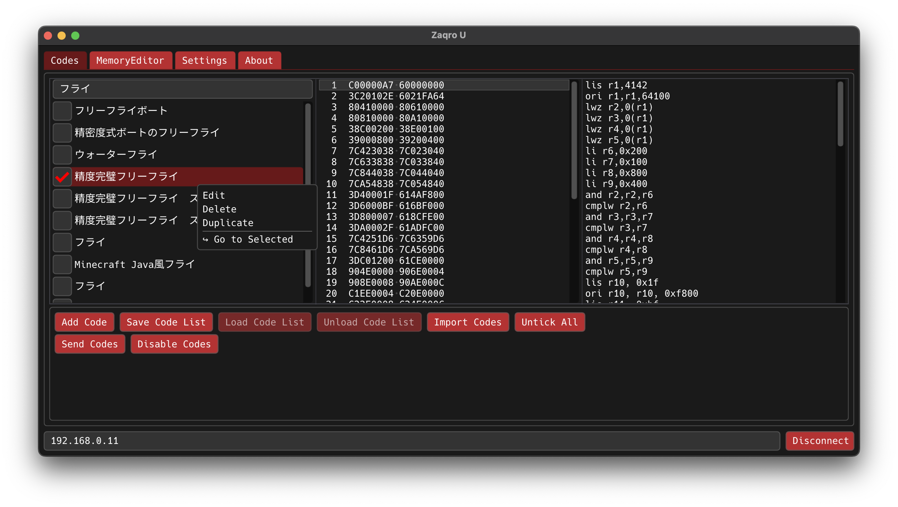

# Zaqro U

Zaqro U は、Wii U 向けのチートツールです。C++20 を使用しており、GUI や描画には GLFW、ImGui、OpenGL などのライブラリを利用しています。

 
 
内部開発コードネームとして「Raim」が使われていますが、利用やビルドに影響はありません。  
「Zaqro」は、私の名前「イラン人」にちなんで、**イランの代表的な果物「ザクロ」**を日本語風にアレンジしたものです。
「U」は、対象プラットフォームである Wii U や、同系統のツール「JGecko U」へのオマージュです。

## 背景
既存のツール「JGecko U」は、サポートが不十分でエラーが多く、開発も非公開で行われており、開発者によるユーザーへの不適切な発言も見受けられました。
こうした状況に不満を感じたため、まだ未完成ではありますが、代替となるツールを自ら作成することにしました。

## 必要環境

- CMake ≥ 3.15  
- C++20 対応のコンパイラ  
- [vcpkg](https://github.com/microsoft/vcpkg) による依存関係の管理

## 使用ライブラリ

本プロジェクトでは以下のライブラリを使用しています。すべて [vcpkg](https://github.com/microsoft/vcpkg) を用いて導入可能です。

- [GLFW](https://www.glfw.org/) — ウィンドウ作成および入力処理  
- [OpenGL](https://www.opengl.org/) — グラフィックス API  
- [GLAD](https://github.com/Dav1dde/glad) — OpenGL ローダー（関数読み込み）  
- [ImGui](https://github.com/ocornut/imgui) — GUI ライブラリ  
- [cURL](https://curl.se/libcurl/) — HTTP 通信ライブラリ  
- [LZ4](https://github.com/lz4/lz4) — 高速圧縮ライブラリ  
- [nlohmann/json](https://github.com/nlohmann/json) — JSON パーサ／シリアライザ  
- [tinyxml2](https://github.com/leethomason/tinyxml2) — 軽量 XML パーサ  
- [tinyfiledialogs](https://sourceforge.net/projects/tinyfiledialogs/) — クロスプラットフォームなファイルダイアログ  
- [Boost.Asio](https://www.boost.org/doc/libs/release/libs/asio/) — ソケット通信ライブラリ（Wii U との TCP 通信）

## ビルド方法

⚠️ **/path/to/vcpkg は実際の vcpkg のパスに置き換えてください。**

```bash
git clone https://github.com/Iranjin/ZaqroU.git
cd ZaqroU
cmake -B build -S . -DCMAKE_TOOLCHAIN_FILE=/path/to/vcpkg/scripts/buildsystems/vcpkg.cmake
cmake --build build
```

### Ninja を使用する場合

```bash
git clone https://github.com/Iranjin/ZaqroU.git
cd ZaqroU
cmake -B build -S . -G Ninja -DCMAKE_TOOLCHAIN_FILE=/opt/vcpkg/scripts/buildsystems/vcpkg.cmake
ninja -C build
```

## Licenses
licensed under the MIT License. See `THIRD_PARTY_LICENSES` for details.
